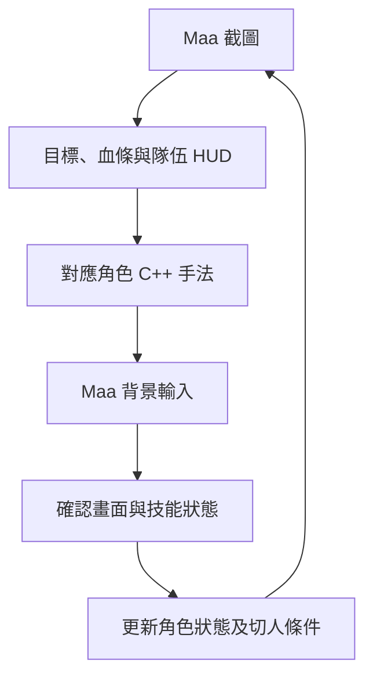

# 架構與修改位置

執行主體為 C++。MaaFramework 負責 Win32 截圖、模板辨識、OCR 與輸入；角色條件、手法、輪廓／色值判斷及切人規則保留為可修改的 C++ 檔。

## 角色與共用流程

`CharFactory.h` 保存 51 名角色的辨識與屬性；`OriginalCharFactory.h` 建立各自的手法物件。每名角色的 `.h` 保留對應原碼分支，並在有覆寫時保存自己的 `get_switch_priority`。

`OriginalBaseChar.h` 提供共用技能、普通點擊、重擊、變奏等待及狀態更新。`BaseCombatTask.h` 接入 Maa API，持續監看戰鬥，處理畫面快取、角色重用、切人確認與停止。

## 辨識

`MaaFrameRecognition.h` 保留原始畫面尺寸，依 `OriginalBoxes.h`／`OriginalTemplates.h` 的來源尺寸縮放模板及 ROI，再透過 Maa TemplateMatch 判斷。原碼指定的灰階、白色預處理與形狀補判有對應處理。

`OriginalCooldown.h` 接入 Maa OCR；`OriginalHealthBar.h`、`OriginalConcerto.h` 與 `OriginalVision.h` 保留血條、協奏及能量的原碼算法。輪廓與形狀補判使用 Maa 隨附的原生 OpenCV。

## 时间

`OriginalTiming.h` 處理原始輸入窗口與等待；`OriginalFreeze.h` 記錄動畫停時。角色檔中的秒數、技能順序與退出條件應與 SOURCES.md 對應原碼一起修改。

歷史的輔助測試與較早架構檔保留於原碼；目前戰鬥入口以 `main.cpp` → `run_combat` → `OriginalCharFactory` 為準。
